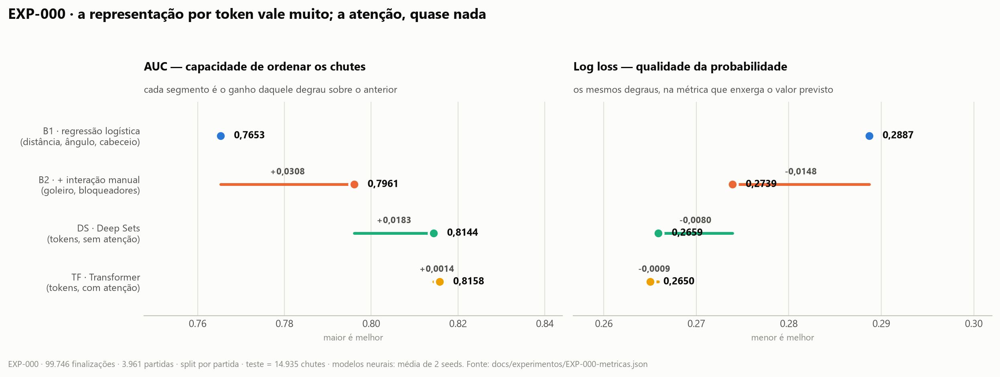

# Relatório final — rascunho de trabalho

> **Este é o rascunho, não a entrega.** A entrega é um PDF no template SBC, até 15
> páginas, com link para o repositório. Este arquivo é onde o texto amadurece.
>
> **Regra:** todo número aqui carrega o ID do experimento que o produziu. O que
> ainda não foi medido aparece como `[PENDENTE]` e **nunca** como número
> provisório — número provisório vira número final por esquecimento.
>
> Estado em **2026-08-09**: seções 1 e 2 escrevíveis quase por inteiro; seção 3
> tem apenas o EXP-000; seção 4 depende dos experimentos que faltam.

**Título:** O jogador como token: um set Transformer sobre freeze-frames para
estimativa de Expected Goals
**Autor:** Vinícius Siqueira · **Disciplina:** CCM-109 — UFABC
**Repositório:** https://github.com/vinisique/xg-set-transformer

---

## Mapa da entrega × critérios de avaliação

| Seção | Peso do critério | Estado |
|---|---|---|
| 1. Descrição do Problema | parte de "clareza" (25%) | **escrevível agora** |
| 2. Abordagem | "qualidade técnica" (35%) | **escrevível agora**, exceto o baseline com literatura |
| 3. Resultados | parte de "análise crítica" (25%) | só EXP-000 |
| 4. Lições Aprendidas | "análise crítica" (25%) | depende dos EXP-001…005 |
| Repositório documentado | "reprodutibilidade" (15%) | **feito** — README + docs/ |

---

## 1. Descrição do Problema

### 1.1 Contexto e motivação

Expected Goals (xG) é hoje a métrica central da análise de futebol profissional:
estima a probabilidade de uma finalização terminar em gol e permite avaliar
desempenho para além do placar, que é um sinal ruidoso e de baixa frequência.

Os modelos clássicos de xG usam apenas atributos do próprio chute — distância,
ângulo de visão da baliza, parte do corpo. Quando incorporam os demais jogadores,
fazem-no por **features desenhadas à mão**: distância do goleiro, número de
defensores na linha do chute, pressão sobre o chutador. Cada uma dessas features
é uma hipótese humana sobre o que importa numa finalização.

### 1.2 Pergunta de pesquisa

> Um modelo que trata **cada jogador como um token** e usa self-attention aprende
> sozinho a geometria de interação que hoje exige engenharia manual de atributos?

A pergunta é interessante porque tem uma resposta possível em cada direção, e
ambas são informativas. Se sim, a engenharia manual de features de interação é
dispensável. Se não, isso indica que a informação relevante é **por jogador** e
não **entre jogadores** — um resultado que contraria a intuição de que futebol é
um jogo de interações.

### 1.3 Definição formal

Cada finalização é um par (cena, desfecho). A cena é um **conjunto** de até 22
jogadores, cada um descrito por um vetor de atributos geométricos; o desfecho é
binário (gol / não-gol). O objetivo é aprender uma função que mapeia o conjunto
para uma probabilidade em [0, 1].

A propriedade que define o problema é a **invariância à permutação**: a ordem em
que os jogadores são listados não carrega informação, e portanto embaralhá-la não
pode alterar a previsão. Isso distingue o problema de tarefas sequenciais e
justifica a ausência de positional encoding — decisão registrada em
`docs/decisoes/` e argumentada na seção 2.

> Observação para o texto final: vale explorar o contraste com a Aula 4 da
> disciplina, onde a invariância à ordem do pooling médio é apresentada como um
> **defeito** ("o cachorro mordeu o homem" = "o homem mordeu o cachorro"). No
> nosso problema a mesma propriedade é desejável. Mesmo fenômeno, sinal invertido,
> porque o dado é conjunto e não sequência.

---

## 2. Abordagem

### 2.1 Dados

StatsBomb Open Data (uso não comercial com atribuição). Após excluir pênaltis e
lances sem freeze-frame: **[EXP-000]**

| | |
|---|---|
| Finalizações | 99.746 |
| Partidas | 3.961 |
| Competições-temporada | 80 |
| Taxa de gol | 10,26% |
| Jogadores visíveis por cena | média 13,1 · mínimo 1 · máximo 21 |

**Limitações dos dados que precisam estar no texto** — declará-las é mais forte
que omiti-las:

- O freeze-frame fornece **posição, não velocidade nem direção**. Um defensor
  parado e um em corrida de recuperação são indistinguíveis para o modelo.
- **30,7% das finalizações vêm de competições femininas** e cerca de 37% de
  apenas quatro temporadas 2015/16 de ligas europeias. As taxas de gol são
  praticamente iguais entre os dois grupos (10,4% vs 10,2%), o que sustenta
  tratá-los juntos, mas a decisão precisa ser explícita.
- A média de **13 jogadores visíveis** — e não 22 — faz do mascaramento de
  padding o caso comum, não a exceção.
- A **Copa do Mundo de 2026 não está disponível** na base pública, ao contrário do
  que a proposta previa. `[decisão pendente sobre o estudo de caso]`

### 2.2 Representação: o jogador como token

Cada cena vira um conjunto de até 22 tokens (chutador + jogadores do
freeze-frame), cada um com 14 atributos: geometria absoluta, geometria **relativa
ao chutador e à linha do chute** (projeção sobre a linha, distância perpendicular,
presença no triângulo formado com os postes) e indicadores de papel
(companheiro / adversário / goleiro).

A escolha das features relativas é deliberada e precisa ser justificada no texto:
elas dão a cada token informação sobre sua própria relação com o chute, **sem**
codificar relações par a par entre jogadores. Isso mantém a ablação honesta — o
que separa Deep Sets do Transformer continua sendo apenas a atenção.

### 2.3 Arquitetura

Encoder Transformer compacto: 2 camadas, 4 cabeças, dimensão 48, token `[CLS]`,
**sem positional encoding**, com máscara de padding nas posições sem jogador.
Saída sigmoide. Implementação em PyTorch.

`[PENDENTE: figura do diagrama da arquitetura — cena → tokens → encoder → xG]`

### 2.4 Protocolo experimental

**Escada de baselines.** Cada degrau acrescenta exatamente uma capacidade, de modo
que a diferença entre degraus atribui o mérito a um componente específico:

| | Modelo | O que acrescenta |
|---|---|---|
| B1 | Regressão logística: distância, ângulo, cabeceio | o xG "de livro" |
| B2 | B1 + features manuais de interação | interação **feita à mão** |
| DS | Deep Sets sobre os tokens | informação por jogador, **sem** comparação par a par |
| TF | Transformer sobre os mesmos tokens | interação **par a par aprendida** |

A comparação decisiva é **TF vs. DS**: ambos recebem exatamente os mesmos tokens,
e apenas o Transformer pode comparar jogadores entre si.

**Divisão dos dados: por partida** (70/15/15). Chutes da mesma partida
compartilham time, adversário e contexto tático; separá-los entre treino e teste
inflaria a métrica por vazamento.

**Métricas.** AUC (ordenação), log loss, **Brier score** e **curva de calibração**
(qualidade da probabilidade), além de **calibração agregada** — xG somado por
partida contra gols observados. `[decisão 0001 define qual delas decide]`

`[PENDENTE: features do baseline B2 alinhadas à literatura de xG, com citação]`

---

## 3. Resultados

> **Estado: preliminar.** Apenas o EXP-000 foi executado. Ele é o marco zero, não
> uma conclusão.

### 3.1 Escada de baselines [EXP-000]

| Modelo | AUC | Log loss | Ganho em AUC sobre o degrau anterior |
|---|---|---|---|
| B1 | 0,7653 | 0,2887 | — |
| B2 | 0,7961 | 0,2739 | +0,0308 |
| DS | 0,8144 | 0,2659 | +0,0183 |
| TF | 0,8158 | 0,2650 | +0,0014 |

Teste com 14.935 finalizações; modelos neurais com média de 2 seeds.

**Dois achados.** Primeiro, a representação por token tem valor claro: o salto de
B2 para Deep Sets (+0,0183 de AUC) mostra que dar ao modelo a cena inteira supera
resumi-la em features manuais. Segundo, e mais importante para a pergunta do
trabalho, **a atenção acrescenta quase nada** sobre Deep Sets: +0,0014 de AUC, da
mesma ordem do desvio entre seeds do próprio Transformer (±0,0006).

Nenhuma conclusão pode ser tirada desse segundo ponto sem teste estatístico
pareado — ver seção 3.3.

### 3.2 Calibração [EXP-000]

`[PENDENTE: curva de calibração, Brier e ECE — execução em curso]`

### 3.3 Transformer vs. Deep Sets: o teste da pergunta central

`[PENDENTE: EXP-004 — 5+ seeds e bootstrap pareado]`

### 3.4 Interpretabilidade: mapas de atenção

`[PENDENTE: EXP-005 — o modelo olha para o goleiro e para os bloqueadores sem
tê-los recebido como feature?]`

### 3.5 Estudo de caso qualitativo

`[PENDENTE: decisão sobre qual torneio, já que a Copa de 2026 não está na base]`

---

## 4. Lições Aprendidas

> Alimentada por `docs/decisoes/` e pelos experimentos que não funcionaram. O
> professor pediu explicitamente que estes fossem documentados.

### 4.1 O que funcionou

**Escalar os dados resolveu o que parecia ser problema de arquitetura.** Na prova
de conceito com 6.347 finalizações, os modelos neurais ficavam em ~0,71 de AUC,
**abaixo** do baseline com features manuais (0,736). Com 99.746 finalizações, os
dois modelos neurais superam esse baseline com folga [EXP-000]. A conclusão
precipitada — "a arquitetura não serve" — teria sido errada.

### 4.2 O que não funcionou

`[PENDENTE: preenchido pelas tentativas do cartão 0002, funcionem ou não]`

### 4.3 O que eu faria diferente

`[PENDENTE]`

---

## Pendências que bloqueiam a escrita

1. Decisão `0001` — qual métrica decide.
2. Decisão `0002` — as quatro tentativas antes de aceitar resultado negativo.
3. Decisão sobre a Copa de 2026.
4. EXP-001 a EXP-005.
5. Baixar o template SBC e migrar o texto.
6. Diagrama da arquitetura.
