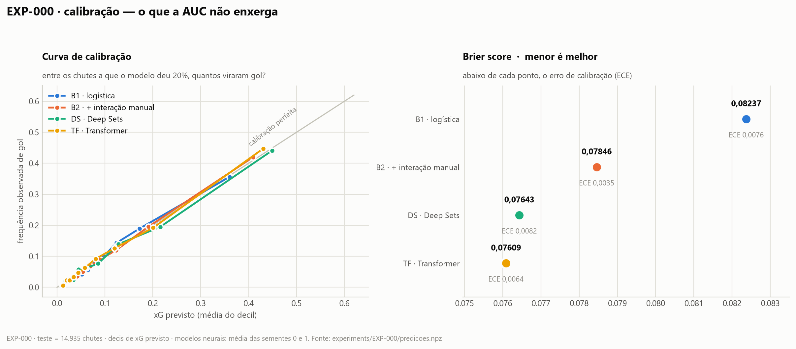
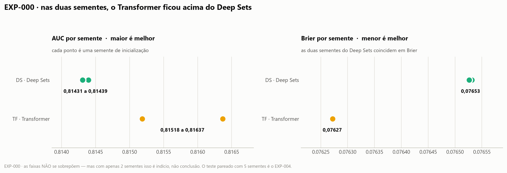

# Log de experimentos

**Append-only.** Nenhuma linha é editada ou apagada depois de escrita, nem quando
o resultado é ruim — resultado ruim é dado, e o professor pediu explicitamente
que experimentos malsucedidos fossem documentados.

**Regra de ouro:** nenhum número entra no relatório final sem um ID desta tabela.

Convenções:
- **AUC** — só ordenação; não enxerga calibração. Maior é melhor.
- **Log loss** e **Brier** — qualidade da probabilidade. Menor é melhor.
- Modelos neurais: sempre média ± desvio sobre múltiplas seeds.
- Split sempre **por partida** (70/15/15), semente do split fixa em 0.

---

## Índice

| ID | O que testou | Dados | Resultado em uma linha |
|---|---|---|---|
| EXP-000 | Linha de base herdada da PoC (B1/B2/DeepSets/Transformer) | `shots_all.npz` | Os neurais **superam** o baseline manual em escala; mas a atenção acrescenta quase nada sobre Deep Sets (+0,0014 AUC) |

---

## EXP-000 — linha de base herdada da PoC

- **Data:** 2026-08-09
- **Script:** `poc/poc3_xg3.py` (código da PoC, sem alterações)
- **Dados:** `poc/shots_all.npz` — 99.746 finalizações, 3.961 partidas, 10,26% gols
- **Objetivo:** estabelecer o ponto de partida real em dados completos. Os números
  citados na proposta (B1 = 0,709 · B2 = 0,736 · neurais ≈ 0,71) vieram do dataset
  pequeno de 6.347 chutes, e **nunca foram reproduzidos na base completa**.
- **Configuração:** dim 48, 2 camadas, 4 cabeças, dropout 0,1, AdamW lr 1e-3,
  weight decay 1e-3, batch 256, early stopping por AUC de validação (paciência 8),
  máximo 60 épocas, seeds 0 e 1.

**Split:** treino 69.756 · validação 15.055 · teste 14.935 finalizações.

**Resultado [medido]** (conjunto de teste, split por partida):

| Modelo | AUC | Log loss | Δ AUC vs. degrau anterior |
|---|---|---|---|
| B1 — LR (distância, ângulo, cabeceio) | 0,7653 | 0,2887 | — |
| B2 — LR + interação manual | 0,7961 | 0,2739 | **+0,0308** |
| DS — Deep Sets (sem atenção) | 0,8144 ±0,0000 | 0,2659 ±0,0001 | **+0,0183** |
| TF — Transformer (com atenção) | 0,8158 ±0,0006 | 0,2650 ±0,0000 | **+0,0014** |

Modelos neurais: média ± desvio sobre as seeds 0 e 1.

### Evidência visual

*Figura gerada por `poc/fig_escada.py` a partir de `EXP-000-metricas.json`.
Cada segmento é o ganho daquele degrau sobre o anterior — a forma foi escolhida
para que o incremento seja o que o olho vê primeiro, já que é ele que responde à
pergunta do projeto. Pontos em vez de barras porque as AUCs vivem entre 0,76 e
0,82: barras desde a origem esconderiam as diferenças, e barras truncadas
mentiriam sobre a proporção.*

## Leitura

**1. A escala resolveu o problema que a proposta apontava.** Na PoC com 6.347
chutes, os modelos neurais ficavam em ~0,71, **abaixo** do baseline com features
manuais (0,736). Com 99.746 chutes, os dois modelos neurais passam o B2 com folga
(+0,018 e +0,020 de AUC). A hipótese de que faltavam dados, e não arquitetura,
se confirmou.

**2. A representação "jogador como token" tem valor claro.** O salto de B2 para
Deep Sets é de **+0,0183 AUC** — maior que o salto de B1 para B2 seria capaz de
sugerir como teto para features de interação. Dar ao modelo a cena inteira, em vez
de resumos feitos à mão, funciona.

**3. Mas a atenção, especificamente, acrescenta quase nada.** A diferença entre
Transformer e Deep Sets é de **+0,0014 AUC** e **−0,0009 log loss** — cerca de
**13× menor** que o ganho do degrau anterior, e da mesma ordem do desvio entre
seeds do próprio Transformer (±0,0006). **Nenhuma conclusão pode ser tirada daqui
sem teste estatístico pareado** — é exatamente a lacuna apontada em
`ESTADO_ATUAL.md`, e o motivo pelo qual EXP-004 existe.

Como Deep Sets processa cada jogador isoladamente e o Transformer pode comparar
jogadores par a par, esse resultado sugere — **sem provar** — que quase toda a
informação útil da cena está *por jogador*, e não na relação entre eles. Se
confirmado, essa é a resposta à pergunta central do projeto, e é um resultado
negativo **interessante**, não um fracasso: significa que a geometria de interação
já está codificada nas features relativas de cada token (projeção na linha do
chute, distância perpendicular, dentro do triângulo do gol), e a atenção não tem
o que acrescentar.

---

## EXP-000b — reexecução com previsões salvas, Brier e calibração

- **Data:** 2026-08-09 · **Script:** `poc/exp000_evidencia.py` · **Figuras:** `poc/fig_exp000.py`
- **Por quê:** o `poc3_xg3.py` descartava as previsões. Sem elas não há curva de
  calibração, nem Brier, nem teste pareado — só os quatro números finais.
- **Previsões salvas:** `experiments/EXP-000/predicoes.npz` (fora do git).

**Resultado [medido]:**

| Modelo | AUC | Log loss | **Brier** | ECE |
|---|---|---|---|---|
| B1 | 0,7653 | 0,2887 | 0,08237 | 0,0076 |
| B2 | 0,7961 | 0,2739 | 0,07846 | **0,0035** |
| DS | 0,8149 | 0,2655 | 0,07643 | 0,0082 |
| TF | **0,8169** | **0,2644** | **0,07609** | 0,0064 |

> **Nota de comparabilidade:** aqui as previsões das duas sementes são
> **combinadas** (média das probabilidades) e as métricas calculadas sobre o
> conjunto; no EXP-000 original a média era das *métricas*. Combinar previsões é
> melhor, e é por isso que a AUC do DS sobe de 0,8144 para 0,8149. As duas
> tabelas **não são comparáveis linha a linha**; os valores por semente, sim, e
> esses batem exatamente.

### Evidência visual

## Leitura do EXP-000b

**1. Correção de uma leitura anterior minha.** Ao ver `+0,0014` de AUC e um desvio
de `±0,0006` entre sementes, eu afirmei que o ganho da atenção estava "da ordem do
ruído". **Isso estava errado**, e os valores por semente mostram por quê:

| | semente 0 | semente 1 | faixa |
|---|---|---|---|
| DS — AUC | 0,81439 | 0,81431 | 0,81431 – 0,81439 |
| TF — AUC | 0,81518 | 0,81637 | 0,81518 – 0,81637 |

As faixas **não se sobrepõem**: a pior rodada do Transformer é melhor que a melhor
rodada do Deep Sets, em AUC e em Brier. Com 2 sementes isso é **indício, não
conclusão** — mas é um indício na direção oposta à que eu havia descrito. A
primeira versão da figura chegou a levar o título "o ganho da atenção é da ordem
do ruído entre seeds", afirmando o contrário do que os próprios dados mostravam;
foi corrigida.

**2. O achado mais interessante está no ECE, e não no Brier.** Repare que o
**B2 é o modelo mais bem calibrado de todos** (ECE 0,0035), apesar de ter o
segundo pior Brier. Os modelos neurais têm Brier melhor e calibração **pior**.

Isso não é contradição: o Brier se decompõe em *calibração* (as probabilidades
batem com a realidade?) e *refinamento* (o modelo separa bem os casos?). Os
modelos neurais ganham no refinamento e perdem na calibração; o saldo é positivo,
por isso o Brier melhor.

**A consequência prática é direta:** existe ganho fácil disponível. Se
recalibrarmos DS e TF — que é exatamente a tentativa **T1** do cartão `0002` e o
pedido nº 1 do professor — o Brier deve melhorar sem tocar na arquitetura. Uma
regressão logística simples está entregando calibração melhor que um Transformer,
e isso é um parágrafo forte para a análise crítica.

## Limitações deste experimento

- Apenas **2 seeds** — insuficiente para afirmar qualquer coisa sobre a diferença
  TF vs. DS.
- **Sem teste estatístico.** Não sabemos se +0,0014 é sinal ou ruído.
- **Sem Brier score, sem curva de calibração, sem calibração agregada.** As
  métricas que o professor pediu não existem aqui.
- Seleção de modelo e early stopping por **AUC**, não por Brier — ver cartão
  `0001`.

Este experimento é o marco zero. Nada dele entra no relatório como conclusão;
entra como ponto de partida.
