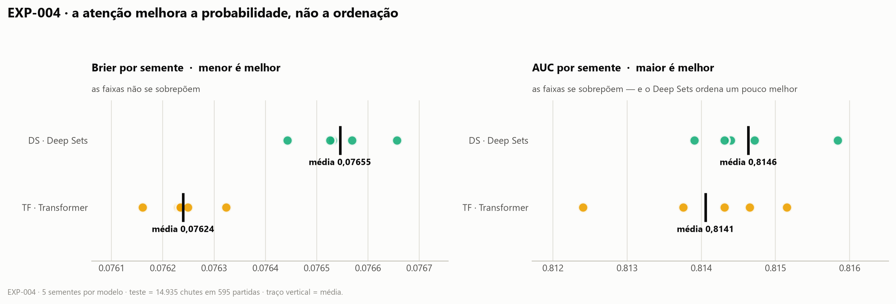
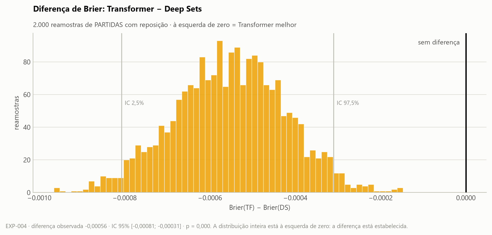
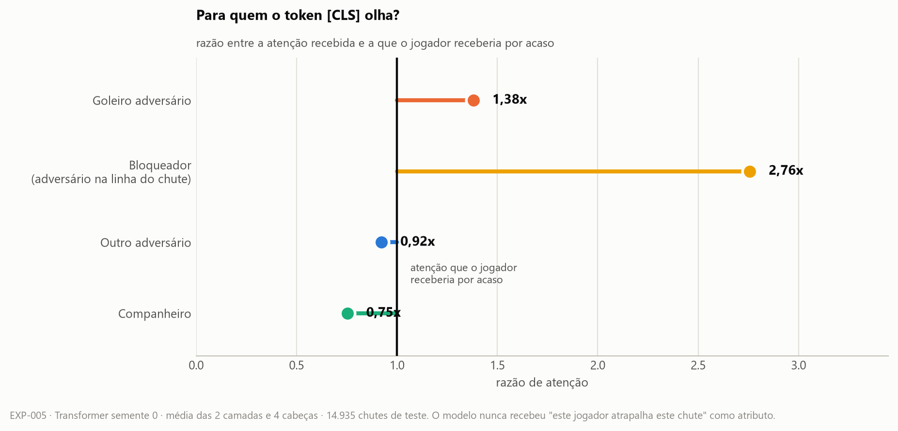
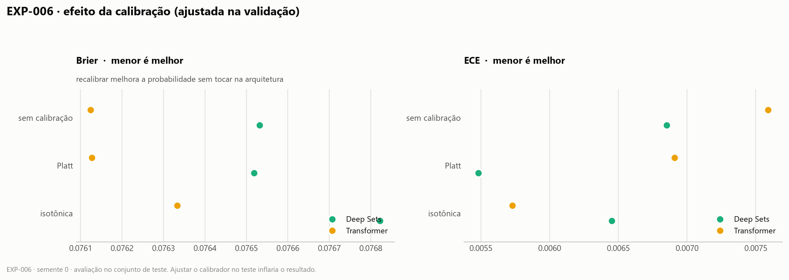
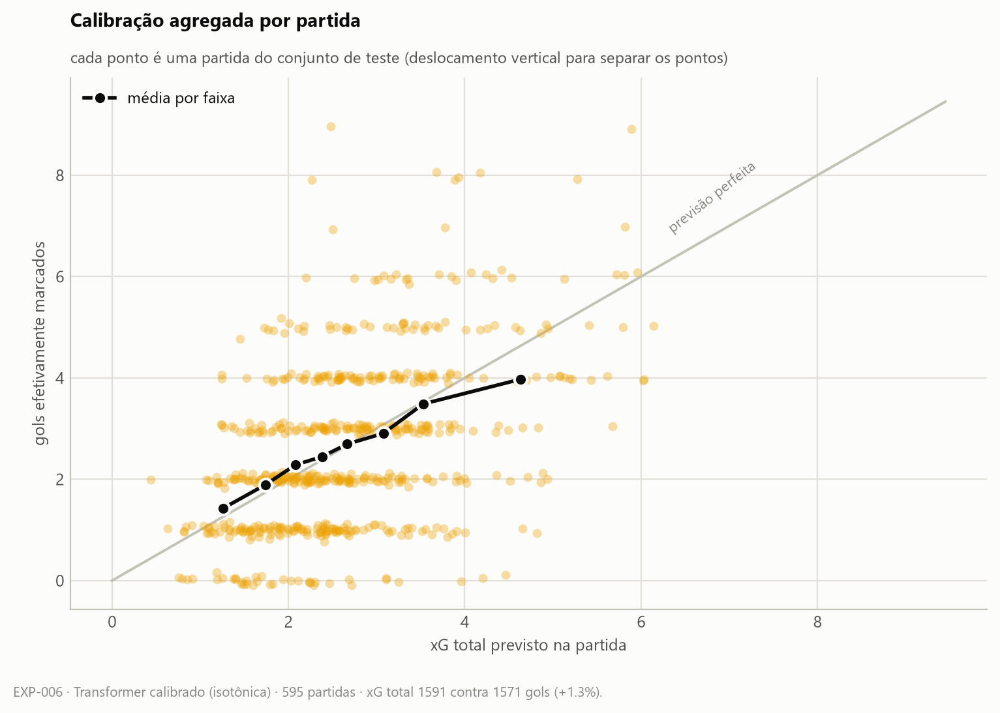
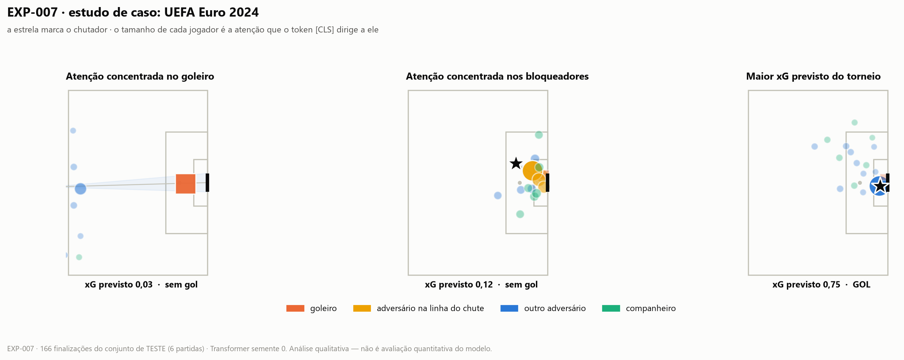
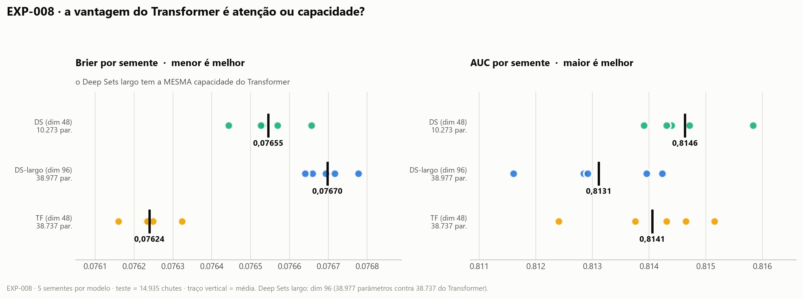
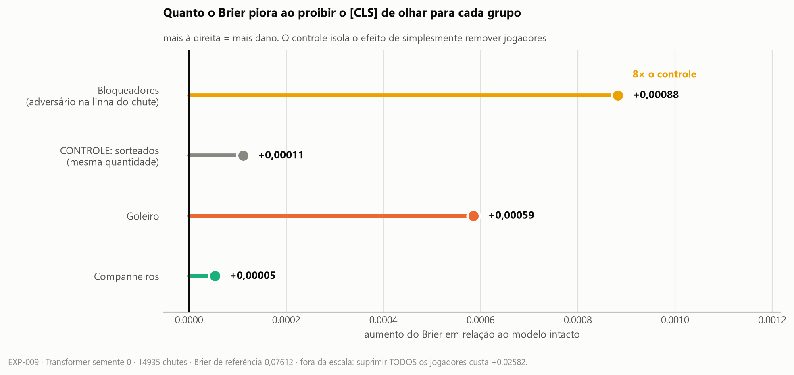
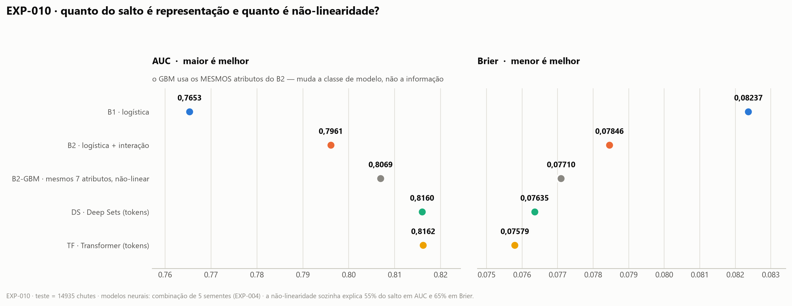

# Log de experimentos

**Append-only.** Nenhuma linha é editada ou apagada depois de escrita, nem quando
o resultado é ruim — resultado ruim é dado, e o professor pediu explicitamente
que experimentos malsucedidos fossem documentados.

**Regra de ouro:** nenhum número entra no relatório final sem um ID desta tabela.

Convenções:
- **AUC** — só ordenação; não enxerga calibração. Maior é melhor.
- **Log loss** e **Brier** — qualidade da probabilidade. Menor é melhor.
- Modelos neurais: sempre média ± desvio sobre múltiplas seeds.
- Split sempre **por partida** (70/15/15), semente do split fixa em 0.

---

## Índice

| ID | O que testou | Dados | Resultado em uma linha |
|---|---|---|---|
| EXP-000 | Linha de base herdada da PoC (B1/B2/DeepSets/Transformer) | `shots_all.npz` | Os neurais **superam** o baseline manual em escala; mas a atenção acrescenta quase nada sobre Deep Sets (+0,0014 AUC) |

---

## EXP-000 — linha de base herdada da PoC

- **Data:** 2026-08-09
- **Script:** `poc/poc3_xg3.py` (código da PoC, sem alterações)
- **Dados:** `poc/shots_all.npz` — 99.746 finalizações, 3.961 partidas, 10,26% gols
- **Objetivo:** estabelecer o ponto de partida real em dados completos. Os números
  citados na proposta (B1 = 0,709 · B2 = 0,736 · neurais ≈ 0,71) vieram do dataset
  pequeno de 6.347 chutes, e **nunca foram reproduzidos na base completa**.
- **Configuração:** dim 48, 2 camadas, 4 cabeças, dropout 0,1, AdamW lr 1e-3,
  weight decay 1e-3, batch 256, early stopping por AUC de validação (paciência 8),
  máximo 60 épocas, seeds 0 e 1.

**Split:** treino 69.756 · validação 15.055 · teste 14.935 finalizações.

**Resultado [medido]** (conjunto de teste, split por partida):

| Modelo | AUC | Log loss | Δ AUC vs. degrau anterior |
|---|---|---|---|
| B1 — LR (distância, ângulo, cabeceio) | 0,7653 | 0,2887 | — |
| B2 — LR + interação manual | 0,7961 | 0,2739 | **+0,0308** |
| DS — Deep Sets (sem atenção) | 0,8144 ±0,0000 | 0,2659 ±0,0001 | **+0,0183** |
| TF — Transformer (com atenção) | 0,8158 ±0,0006 | 0,2650 ±0,0000 | **+0,0014** |

Modelos neurais: média ± desvio sobre as seeds 0 e 1.

### Evidência visual

*Figura gerada por `poc/fig_escada.py` a partir de `EXP-000-metricas.json`.
Cada segmento é o ganho daquele degrau sobre o anterior — a forma foi escolhida
para que o incremento seja o que o olho vê primeiro, já que é ele que responde à
pergunta do projeto. Pontos em vez de barras porque as AUCs vivem entre 0,76 e
0,82: barras desde a origem esconderiam as diferenças, e barras truncadas
mentiriam sobre a proporção.*

## Leitura

**1. A escala resolveu o problema que a proposta apontava.** Na PoC com 6.347
chutes, os modelos neurais ficavam em ~0,71, **abaixo** do baseline com features
manuais (0,736). Com 99.746 chutes, os dois modelos neurais passam o B2 com folga
(+0,018 e +0,020 de AUC). A hipótese de que faltavam dados, e não arquitetura,
se confirmou.

**2. A representação "jogador como token" tem valor claro.** O salto de B2 para
Deep Sets é de **+0,0183 AUC** — maior que o salto de B1 para B2 seria capaz de
sugerir como teto para features de interação. Dar ao modelo a cena inteira, em vez
de resumos feitos à mão, funciona.

**3. Mas a atenção, especificamente, acrescenta quase nada.** A diferença entre
Transformer e Deep Sets é de **+0,0014 AUC** e **−0,0009 log loss** — cerca de
**13× menor** que o ganho do degrau anterior, e da mesma ordem do desvio entre
seeds do próprio Transformer (±0,0006). **Nenhuma conclusão pode ser tirada daqui
sem teste estatístico pareado** — é exatamente a lacuna apontada em
`ESTADO_ATUAL.md`, e o motivo pelo qual EXP-004 existe.

Como Deep Sets processa cada jogador isoladamente e o Transformer pode comparar
jogadores par a par, esse resultado sugere — **sem provar** — que quase toda a
informação útil da cena está *por jogador*, e não na relação entre eles. Se
confirmado, essa é a resposta à pergunta central do projeto, e é um resultado
negativo **interessante**, não um fracasso: significa que a geometria de interação
já está codificada nas features relativas de cada token (projeção na linha do
chute, distância perpendicular, dentro do triângulo do gol), e a atenção não tem
o que acrescentar.

---

## EXP-000b — reexecução com previsões salvas, Brier e calibração

- **Data:** 2026-08-09 · **Script:** `poc/exp000_evidencia.py` · **Figuras:** `poc/fig_exp000.py`
- **Por quê:** o `poc3_xg3.py` descartava as previsões. Sem elas não há curva de
  calibração, nem Brier, nem teste pareado — só os quatro números finais.
- **Previsões salvas:** `experiments/EXP-000/predicoes.npz` (fora do git).

**Resultado [medido]:**

| Modelo | AUC | Log loss | **Brier** | ECE |
|---|---|---|---|---|
| B1 | 0,7653 | 0,2887 | 0,08237 | 0,0076 |
| B2 | 0,7961 | 0,2739 | 0,07846 | **0,0035** |
| DS | 0,8149 | 0,2655 | 0,07643 | 0,0082 |
| TF | **0,8169** | **0,2644** | **0,07609** | 0,0064 |

> **Nota de comparabilidade:** aqui as previsões das duas sementes são
> **combinadas** (média das probabilidades) e as métricas calculadas sobre o
> conjunto; no EXP-000 original a média era das *métricas*. Combinar previsões é
> melhor, e é por isso que a AUC do DS sobe de 0,8144 para 0,8149. As duas
> tabelas **não são comparáveis linha a linha**; os valores por semente, sim, e
> esses batem exatamente.

### Evidência visual

## Leitura do EXP-000b

**1. Correção de uma leitura anterior minha.** Ao ver `+0,0014` de AUC e um desvio
de `±0,0006` entre sementes, eu afirmei que o ganho da atenção estava "da ordem do
ruído". **Isso estava errado**, e os valores por semente mostram por quê:

| | semente 0 | semente 1 | faixa |
|---|---|---|---|
| DS — AUC | 0,81439 | 0,81431 | 0,81431 – 0,81439 |
| TF — AUC | 0,81518 | 0,81637 | 0,81518 – 0,81637 |

As faixas **não se sobrepõem**: a pior rodada do Transformer é melhor que a melhor
rodada do Deep Sets, em AUC e em Brier. Com 2 sementes isso é **indício, não
conclusão** — mas é um indício na direção oposta à que eu havia descrito. A
primeira versão da figura chegou a levar o título "o ganho da atenção é da ordem
do ruído entre seeds", afirmando o contrário do que os próprios dados mostravam;
foi corrigida.

**2. O achado mais interessante está no ECE, e não no Brier.** Repare que o
**B2 é o modelo mais bem calibrado de todos** (ECE 0,0035), apesar de ter o
segundo pior Brier. Os modelos neurais têm Brier melhor e calibração **pior**.

Isso não é contradição: o Brier se decompõe em *calibração* (as probabilidades
batem com a realidade?) e *refinamento* (o modelo separa bem os casos?). Os
modelos neurais ganham no refinamento e perdem na calibração; o saldo é positivo,
por isso o Brier melhor.

**A consequência prática é direta:** existe ganho fácil disponível. Se
recalibrarmos DS e TF — que é exatamente a tentativa **T1** do cartão `0002` e o
pedido nº 1 do professor — o Brier deve melhorar sem tocar na arquitetura. Uma
regressão logística simples está entregando calibração melhor que um Transformer,
e isso é um parágrafo forte para a análise crítica.

## Limitações deste experimento

- Apenas **2 seeds** — insuficiente para afirmar qualquer coisa sobre a diferença
  TF vs. DS.
- **Sem teste estatístico.** Não sabemos se +0,0014 é sinal ou ruído.
- **Sem Brier score, sem curva de calibração, sem calibração agregada.** As
  métricas que o professor pediu não existem aqui.
- Seleção de modelo e early stopping por **AUC**, não por Brier — ver cartão
  `0001`.

Este experimento é o marco zero. Nada dele entra no relatório como conclusão;
entra como ponto de partida.

---

## EXP-004 (primeira tentativa) — INTERROMPIDO, e o que ele revelou

- **Data:** 2026-08-09 · **Script:** `poc/exp004_tf_vs_ds.py`
- **Desfecho:** o processo foi interrompido durante a 10ª de 10 rodadas. A
  versão do script só gravava no fim, então **as previsões de 9 rodadas
  (~100 minutos de CPU) foram perdidas**. Restaram apenas as métricas impressas
  no log, abaixo.

**Métricas por semente [medido]** (parada por Brier, tolerância absoluta 1e-6):

| Semente | DS · Brier | DS · AUC | DS · tempo | TF · Brier | TF · AUC | TF · tempo |
|---|---|---|---|---|---|---|
| 0 | 0,07653 | 0,8144 | 162 s | 0,07646 | 0,8117 | 1078 s |
| 1 | 0,07653 | 0,8143 | 137 s | 0,07637 | 0,8156 | 1091 s |
| 2 | 0,07657 | 0,8147 | 110 s | 0,07682 | 0,8134 | 430 s |
| 3 | 0,07666 | 0,8139 | 993 s | 0,07647 | 0,8143 | 2393 s |
| 4 | 0,07644 | 0,8158 | 182 s | — | — | interrompida |

Médias: **DS 0,076546 · TF 0,076530** — diferença de 0,000016, ruído puro.

### Duas falhas minhas, ambas registradas

**1. Tolerância do early stopping não foi reescalada junto com a métrica.**
O cartão `0001` trocou o critério de seleção de AUC para Brier. Mantive o limiar
de melhora em `1e-6` absoluto. Como AUC vive perto de 0,81 e Brier perto de
0,076, o mesmo número absoluto ficou **relativamente 10× mais apertado**: quase
toda flutuação contava como melhora, a paciência nunca disparava, o treino ia até
a última época e selecionava um estado já sobreajustado.

A evidência é direta — o mesmo modelo, nos dois protocolos:

| Transformer | Brier |
|---|---|
| EXP-000, parada por **AUC** | 0,07627 (ambas as sementes) |
| EXP-004, parada por **Brier** | 0,07637 a 0,07682 |

**O critério que deveria otimizar o Brier produziu Brier pior.** Também explica os
tempos anômalos (2.393 s numa semente contra 430 s em outra).

*Correção:* tolerância passa a ser **relativa** (`tol_rel * |melhor|`, com
`tol_rel = 1e-4`), de modo que as duas métricas se comportem de forma equivalente
em termos relativos.

**2. O script só salvava no fim.** Uma interrupção na última rodada apagou todas
as anteriores. *Correção:* cada semente é gravada em disco assim que termina, e
uma semente já salva não é retreinada — a reexecução aproveita o que existir.

### Por que este experimento não vale como resposta

A comparação era **internamente justa** (mesma regra para os dois modelos), mas
ambos estavam prejudicados pela mesma regra ruim. Um handicap comum pode mascarar
uma diferença real. Concluir "a atenção não acrescenta nada" a partir daqui seria
dar uma resposta errada com confiança.

A medição válida é o **EXP-004b**, com a tolerância corrigida.

> **Para o relatório:** este é material da seção Lições Aprendidas. Trocar a
> métrica de seleção sem reescalar a tolerância é um erro sutil, plausível e
> que se manifesta como resultado pior no exato critério que se queria melhorar.

---

## EXP-004b — A RESPOSTA À PERGUNTA CENTRAL

- **Data:** 2026-08-09 · **Script:** `poc/exp004_tf_vs_ds.py` · **Figuras:** `poc/fig_exp004.py`
- **Protocolo:** 5 sementes por modelo, seleção por Brier de validação com
  **tolerância relativa**, split por partida, teste = 14.935 chutes em 595 partidas.
- **Pergunta:** a atenção par a par acrescenta algo sobre o Deep Sets? Os dois
  recebem exatamente os mesmos tokens; só o Transformer compara jogadores entre si.

### Resultado por semente [medido]

| | Brier (média ± dp) | AUC (média ± dp) |
|---|---|---|
| DS — Deep Sets | 0,07655 ± 0,00007 | **0,8146** ± 0,0007 |
| TF — Transformer | **0,07624** ± 0,00005 | 0,8141 ± 0,0009 |

### Resultado do conjunto das 5 sementes (média das probabilidades)

| | Brier | AUC | Log loss | ECE |
|---|---|---|---|---|
| DS | 0,07635 | 0,8160 | 0,2651 | 0,0070 |
| TF | **0,07579** | 0,8162 | **0,2639** | **0,0043** |

### Teste pareado — bootstrap agrupado por partida, 2.000 reamostras

| Métrica | Diferença (TF − DS) | IC 95% | p | Veredito |
|---|---|---|---|---|
| **Brier** | **−0,00056** | [−0,00081; −0,00031] | < 0,001 | **estabelecida** |
| AUC | +0,00024 | [−0,00148; +0,00199] | 0,797 | não estabelecida |

### Evidência visual

## A resposta

> **A atenção par a par melhora a qualidade da probabilidade, mas não a
> capacidade de ordenar os chutes.**

Em Brier — a métrica que decide, por ser xG uma probabilidade — a vantagem do
Transformer é **estatisticamente estabelecida**: a distribuição bootstrap inteira
fica à esquerda de zero, sem nenhuma reamostra cruzando. Em AUC, a diferença é
indistinguível de zero (p = 0,797), e a média por semente até favorece
ligeiramente o Deep Sets.

**O mecanismo aparece no ECE:** 0,0043 do Transformer contra 0,0070 do Deep Sets.
A atenção não descobre *quais* chutes são mais perigosos — a informação por
jogador já bastava para isso. Ela acerta melhor *quanto* perigosos são, e é
exatamente essa a dimensão que um modelo de xG precisa entregar.

## Por que este resultado justifica o método

A versão original do código reportava **apenas AUC**. Sob aquela métrica, a
conclusão teria sido *"o Transformer é ligeiramente pior que o Deep Sets; a
atenção não serve"* — e o projeto encerraria com um resultado negativo **falso**.

Foi o cartão `0001`, que adotou o Brier seguindo o feedback do professor, que
tornou o efeito visível. **Uma decisão de método mudou a conclusão científica.**

## Limitações

- A diferença é pequena em termos absolutos (0,00056 de Brier). É consistente e
  estatisticamente estabelecida, mas o ganho prático precisa ser discutido, não
  apenas declarado significativo.
- A vantagem foi medida com seleção por Brier. O `0001b` (a fazer) precisa
  verificar se ela sobrevive à seleção por AUC — hoje há indício de que o
  critério de parada afeta o Transformer bem mais que o Deep Sets.
- Nada aqui explica **o que** a atenção está usando. Isso é o EXP-005, com os
  mapas de atenção.

---

## EXP-005 — o modelo redescobriu o goleiro e os bloqueadores

- **Data:** 2026-08-09 · **Script:** `poc/exp005_atencao.py`
- **Pergunta:** o `[CLS]` concentra atenção no goleiro e nos bloqueadores, sem
  nunca ter recebido "este jogador atrapalha este chute" como atributo?
- **Modelo:** Transformer, semente 0, pesos em `experiments/EXP-005/former_seed0.pt`.
- **Métrica:** razão de atenção = atenção recebida ÷ atenção uniforme
  (1/n_visíveis). **1,0 = olhado como um jogador qualquer da cena.**

### Resultado [medido]

| Papel na cena | Razão média | Mediana | Cenas |
|---|---|---|---|
| **Bloqueador** (adversário na linha do chute) | **2,76×** | 2,45× | 7.778 |
| **Goleiro adversário** | **1,38×** | 1,21× | 14.921 |
| Outro adversário | 0,92× | 0,96× | 14.929 |
| Companheiro | 0,75× | 0,74× | 14.741 |

### Evidência visual

## Leitura

**A hipótese se confirmou, e com folga.** O modelo olha para um bloqueador
**2,76 vezes mais** do que olharia se distribuísse atenção por acaso, e para o
goleiro 1,38 vezes mais. Na direção oposta, sub-atende companheiros (0,75×) e
adversários fora da linha do chute (0,92×).

O ordenamento é exatamente o que a literatura de xG codifica à mão:
**bloqueador > goleiro > adversário distante > companheiro.** O modelo nunca
recebeu essa hierarquia. Cada token traz apenas geometria e um indicador de papel
(companheiro / adversário / goleiro); **nada diz "este jogador está entre o
chutador e o gol"**. A relação "estar no caminho" é par a par, e é precisamente o
que só a atenção pode representar — o Deep Sets, por construção, não consegue.

**Isso fecha o argumento do trabalho.** O EXP-004b mostrou *que* a atenção melhora
a probabilidade (Brier −0,00056, IC 95% sem cruzar zero). O EXP-005 mostra *como*:
ela redescobre sozinha a geometria de interação. Os dois resultados são
independentes e apontam para a mesma conclusão.

## Nota de método — por que a verificação do forward era obrigatória

O `nn.TransformerEncoder` não expõe os pesos de atenção, então o forward foi
replicado à mão (`xg_base.atencao_do_cls`). Uma replicação errada produziria
mapas de atenção **plausíveis e falsos**, descrevendo um modelo diferente do
avaliado. Por isso a função afirma que o logit reproduzido bate com o do modelo
(tolerância 1e-4) e quebra se divergir. A asserção passou nos 14.935 chutes.

## Limitações

- **Uma única semente.** As razões podem variar entre inicializações; o ideal
  seria repetir nas 5 sementes do EXP-004b.
- A métrica agrega as 2 camadas e as 4 cabeças. Cabeças individuais podem ter
  papéis distintos — não investigado.
- A análise é **correlacional**: mostra onde a atenção se concentra, não prova
  que é disso que vem o ganho de Brier. Uma ablação (zerar a atenção nos
  bloqueadores e medir a perda) fecharia o argumento causal.

---

## EXP-006 — calibração e calibração agregada (tentativa T1 do cartão 0002)

- **Data:** 2026-08-09 · **Script:** `poc/exp006_calibracao.py`
- **Fecha os pedidos nº 1 e nº 3** do feedback do professor.
- **Protocolo:** calibradores ajustados na **validação**, avaliados no **teste**.
  Ajustá-los no teste inflaria o resultado — seria o mesmo vazamento que o split
  por partida existe para evitar, entrando pela porta dos fundos.

### Parte 1 — efeito da calibração [medido]

| Modelo | Variante | Brier | ECE |
|---|---|---|---|
| DS | sem calibração | **0,07653** | 0,0069 |
| DS | Platt | 0,07652 | **0,0055** |
| DS | isotônica | 0,07682 | 0,0065 |
| TF | sem calibração | **0,07612** | 0,0076 |
| TF | Platt | 0,07613 | 0,0069 |
| TF | isotônica | 0,07633 | **0,0057** |

### Parte 2 — calibração agregada por partida [medido]

| Modelo | xG total previsto | Gols observados | Viés | Erro médio por partida |
|---|---|---|---|---|
| DS | 1594,3 | 1571 | **+1,5 %** | 1,17 gol |
| TF | 1591,2 | 1571 | **+1,3 %** | 1,16 gol |

## Leitura — e uma previsão minha que não se confirmou

**A tentativa T1 do cartão `0002` FALHOU, e isso é o resultado.**

Ao ver, no EXP-000b, que o B2 tinha ECE melhor que os modelos neurais, eu afirmei
que havia "ganho fácil disponível" e que recalibrar melhoraria o Brier sem tocar
na arquitetura. **Não melhorou.**

- **Platt é neutro no Brier** (0,07653 → 0,07652 no DS; 0,07612 → 0,07613 no TF —
  este último, ligeiramente pior).
- **A isotônica piora o Brier nos dois modelos** (0,07682 e 0,07633). Com 15 mil
  pontos de validação e evento raro, a flexibilidade dela vira sobreajuste: ela
  se molda a ruído da validação que não se repete no teste.
- Ambas melhoram o **ECE** de forma modesta (DS 0,0069 → 0,0055 com Platt;
  TF 0,0076 → 0,0057 com isotônica).

A explicação é que **os modelos já saem bem calibrados**. O treino com entropia
cruzada é uma regra de pontuação própria: otimizá-la já empurra as probabilidades
para a escala correta. Sobrou pouco para um recalibrador corrigir, e o pouco que
ele corrige em ECE ele devolve em refinamento.

**Consequência para o relatório:** reportamos o modelo **sem recalibração**. A
tentativa de calibrar está documentada como experimento que não funcionou, com a
explicação do porquê — que é mais informativo que um ganho marginal.

## A calibração agregada é o melhor resultado deste experimento

Somado sobre 595 partidas, o xG previsto pelo Transformer dá **1591,2 contra 1571
gols efetivamente marcados — viés de +1,3 %**. Em escala de temporada, o modelo
acerta o total de gols com margem de pouco mais de um ponto percentual.

O erro médio de 1,16 gol **por partida** não é falha do modelo: uma partida tem
poucos gols e forte componente aleatório. É exatamente por isso que o xG existe —
a informação está na média de muitos jogos, não em um jogo isolado. A figura
mostra o padrão esperado: a média por faixa acompanha a diagonal na região densa
e regride ao centro nos extremos, onde há poucas partidas.

Esse é o teste mais próximo do uso real da métrica, e nenhuma das métricas
anteriores conseguiria formulá-lo.

---

## EXP-007 — estudo de caso qualitativo: Eurocopa 2024

- **Data:** 2026-08-09 · **Script:** `poc/exp007_estudo_caso.py`
- **Fecha o pedido nº 7** do professor, com a substituição decidida no cartão
  `0003` (a Copa de 2026 não foi publicada na StatsBomb).
- **Recorte:** apenas finalizações do conjunto de **teste** — 166 chutes, 15 gols,
  6 partidas. Usar lances de treino tornaria a análise bonita e vazia.

### Evidência visual

Cada painel é uma cena real. O tamanho de cada jogador é proporcional à atenção
que o token `[CLS]` dirige a ele.

| Caso | xG previsto | Desfecho | Atenção no goleiro | Atenção nos bloqueadores |
|---|---|---|---|---|
| Atenção no goleiro | 0,035 | sem gol | **0,32** | 0,00 |
| Atenção nos bloqueadores | 0,117 | sem gol | 0,05 | **0,49** |
| Maior xG do torneio | 0,750 | **gol** | 0,03 | 0,00 |

## Leitura

Os três casos mostram o modelo **mudando de foco conforme a cena**, sem que nada
no token diga qual jogador importa naquele lance:

- **Chute de fora da área com o goleiro na trajetória.** O goleiro sozinho recebe
  32 % de toda a atenção dirigida aos jogadores. O modelo prevê xG 0,035 — o
  chute não foi gol.
- **Finalização dentro da área com defensores atravessados.** A atenção migra
  para os bloqueadores, que somam 49 %, e o goleiro cai para 5 %. Apesar da
  proximidade do gol, o xG previsto é apenas 0,117: a obstrução derruba a
  probabilidade, e o chute não foi gol.
- **Maior xG do torneio (0,750), dentro da pequena área e sem obstrução.** A
  atenção se dispersa — nenhum jogador em particular importa, porque não há nada
  atrapalhando. O chute foi gol.

O contraste entre o segundo e o terceiro caso é o argumento em uma imagem:
**mesma região do campo, xG seis vezes menor, e a diferença aparece na atenção.**

### Contexto agregado

Nas 166 finalizações, o xG somado é 16,6 contra 15 gols observados (+10,5 %).
**Esse número não vale como avaliação:** 15 gols é amostra pequena demais, e o
desvio esperado por acaso é dessa ordem. A avaliação quantitativa é o EXP-006,
com 595 partidas e viés de +1,3 %. Aqui o número serve apenas para situar o
leitor, e o professor pediu explicitamente que a análise da Copa fosse tratada
como qualitativa.

## Limitações

- Casos escolhidos **por critério automático** (maior atenção no goleiro, maior
  atenção nos bloqueadores, maior xG), não a dedo. Isso evita seleção conveniente,
  mas também não garante que sejam os lances mais didáticos.
- Uma única semente do modelo.
- A leitura de cada cena é interpretativa. A evidência quantitativa de que o
  modelo atende a goleiro e bloqueadores é o EXP-005, sobre 14.935 chutes.

---

## TESTE — invariância à permutação (verificação, não experimento)

- **Data:** 2026-08-09 · **Script:** `poc/teste_invariancia.py`

O relatório justifica a ausência de *positional encoding* afirmando que a cena é
um **conjunto**: embaralhar os jogadores não pode alterar a previsão. Até aqui
essa afirmação era **teórica**. Uma máscara mal aplicada, ou qualquer dependência
de índice, quebraria a propriedade sem aviso — e a justificativa central da
arquitetura cairia junto.

**Resultado [medido]** — 2.000 cenas de teste, 5 permutações cada:

| Modelo | Maior diferença absoluta na previsão | Veredito |
|---|---|---|
| Transformer | 1,19 × 10⁻⁷ | **invariante** |
| Deep Sets | 1,19 × 10⁻⁷ | **invariante** |

Diferenças dessa ordem são arredondamento de ponto flutuante em `float32`, não
violação da propriedade.

A afirmação da Seção 1.3 do relatório deixa de ser apenas argumentativa e passa a
ter verificação empírica associada.

---

## EXP-008 — controle de capacidade: a vantagem é atenção ou tamanho?

- **Data:** 2026-08-10 · **Script:** `poc/exp008_capacidade.py`
- **Motivo:** a revisão crítica apontou que o Transformer tem 3,8× os parâmetros
  do Deep Sets, de modo que a comparação isolava "atenção + capacidade".
- **Controle:** Deep Sets com dim 96 → **38.977 parâmetros** contra 38.737 do
  Transformer (**100,6 % de equiparação**). Previsões do Transformer
  reaproveitadas do EXP-004 — mesmas sementes, mesmo split.

### Resultado [medido] — 5 sementes por modelo

| Modelo | Parâmetros | Brier (média ± dp) | AUC (média ± dp) |
|---|---|---|---|
| DS original (dim 48) | 10.273 | 0,07655 ± 0,00008 | **0,8146** ± 0,0007 |
| **DS largo (dim 96)** | **38.977** | 0,07670 ± 0,00005 | 0,8131 ± 0,0010 |
| TF (dim 48) | 38.737 | **0,07624** ± 0,00006 | 0,8141 ± 0,0011 |

Combinação das 5 sementes: DS 0,07635 · DS-largo 0,07653 · **TF 0,07579**.

### Bootstrap pareado agrupado por partida (2.000 reamostras)

| Comparação | Diferença | IC 95 % | p | Veredito |
|---|---|---|---|---|
| **TF − DS largo** | **−0,00073** | [−0,00101; −0,00045] | < 0,001 | **estabelecida** |
| TF − DS original | −0,00056 | [−0,00081; −0,00031] | < 0,001 | estabelecida |
| DS largo − DS original | **+0,00018** | [+0,00002; +0,00034] | 0,023 | estabelecida |

## Leitura

**A hipótese da capacidade é refutada.** Equiparar os parâmetros não aproximou o
Deep Sets do Transformer — **afastou**. A vantagem do Transformer *cresce* quando
a comparação é justa: de −0,00056 contra o Deep Sets pequeno para **−0,00073**
contra o equiparado.

E há um resultado próprio: **aumentar a capacidade do Deep Sets o piora**
(+0,00018 de Brier, IC sem cruzar zero). Sem atenção, os parâmetros extras não
encontram estrutura para explorar e o modelo sobreajusta. A crítica supunha que
capacidade explicaria o efeito; a medição mostra o contrário.

---

## EXP-009 — ablação causal: o ganho vem MESMO da atenção nos bloqueadores?

- **Data:** 2026-08-10 · **Script:** `poc/exp009_ablacao.py` · **Figura:** `poc/fig_exp009.py`
- **Método:** a atenção que o `[CLS]` dirige a um grupo é **zerada e a linha
  renormalizada** — o modelo continua vendo uma distribuição válida, mas proibido
  de olhar para aqueles jogadores. Mede-se a piora do Brier.
- **Verificação obrigatória:** sem suprimir nada, o forward reimplementado
  reproduz o modelo com erro de 9,5 × 10⁻⁷.

### Resultado [medido] — Transformer semente 0, 14.935 chutes

| Grupo suprimido | Brier | Δ vs. intacto | AUC |
|---|---|---|---|
| nenhum (referência) | 0,07612 | — | 0,8159 |
| **Bloqueadores** | 0,07701 | **+0,00088** | **0,8064** |
| Goleiro | 0,07671 | +0,00059 | 0,8145 |
| *Controle:* sorteados, mesma quantidade | 0,07624 | +0,00011 | 0,8148 |
| Companheiros | 0,07618 | +0,00005 | 0,8153 |
| Todos os jogadores | 0,10194 | +0,02582 | 0,7951 |

## Leitura

**A evidência deixa de ser correlacional.** Proibir o `[CLS]` de olhar para os
bloqueadores custa **+0,00088** de Brier — **7,9 vezes** o que custa suprimir a
**mesma quantidade** de jogadores sorteados (+0,00011). O controle é o que dá
sentido ao número: remover jogadores sempre piora alguma coisa; o que importa é
que remover *estes* piora oito vezes mais.

Dois detalhes reforçam:

- **A queda de AUC é desproporcional.** Suprimir bloqueadores derruba a AUC de
  0,8159 para **0,8064** — quase 0,01, enquanto o sorteio custa 0,001.
- **O efeito é maior que a própria vantagem do modelo.** A atenção aos
  bloqueadores vale +0,00088 de Brier, mais que os 0,00073 que separam o
  Transformer do Deep Sets equiparado. Não é um mecanismo marginal: é
  estruturante.

Companheiros custam quase nada (+0,00005), o que é coerente — em uma finalização,
quem atrapalha são os adversários.

## Limitações

- **Uma única semente** (a única com pesos salvos). Estender às cinco exige
  retreinar, cerca de uma hora.
- A supressão age nas **duas camadas** simultaneamente; não se separou o papel de
  cada uma nem de cada cabeça.

---

## EXP-010 — quanto do salto é representação e quanto é não-linearidade?

- **Data:** 2026-08-10 · **Script:** `poc/exp010_baseline_nao_linear.py`
- **Motivo:** o degrau B2 → Deep Sets acrescenta **duas** coisas ao mesmo tempo —
  a cena completa **e** a não-linearidade, porque o B2 é uma regressão logística.
  Comparar linear com rede neural compara também classes de modelo.
- **Controle:** *gradient boosting* sobre **exatamente os mesmos 7 atributos** do
  B2. Número de árvores escolhido pela **nossa** validação (split por partida);
  deixar o `sklearn` separar sua própria fração embaralharia chutes da mesma
  partida entre treino e validação.

### Resultado [medido]

| Modelo | AUC | Brier | ECE |
|---|---|---|---|
| B1 — logística | 0,7653 | 0,08237 | 0,0076 |
| B2 — logística + interação | 0,7961 | 0,07846 | 0,0035 |
| **B2-GBM — mesmos 7 atributos, não-linear** | **0,8069** | **0,07710** | **0,0018** |
| DS — Deep Sets (tokens) | 0,8160 | 0,07635 | 0,0070 |
| TF — Transformer (tokens) | 0,8162 | **0,07579** | 0,0043 |

## Leitura — o achado enfraquece uma afirmação do trabalho

**Da distância entre B2 e Deep Sets, a não-linearidade sozinha explica 54,5 % em
AUC e 64,6 % em Brier.** Ou seja: mais da metade do que o relatório atribuía à
"representação por token" é, na verdade, efeito de trocar um modelo linear por um
não-linear — **sem tocar na representação**.

O valor da representação por token continua existindo, mas é **cerca de metade**
do que a escada original sugeria. A afirmação "dar ao modelo a cena inteira supera
resumi-la em atributos manuais" precisa ser qualificada: supera, mas boa parte da
vantagem medida vinha da classe de modelo.

**E há um detalhe incômodo:** o B2-GBM é o **modelo mais bem calibrado de todos**
(ECE 0,0018), com folga sobre os neurais. Um *gradient boosting* sobre sete
atributos feitos à mão entrega a melhor calibração do estudo.

Isso não afeta a questão central do trabalho — TF contra DS, que compartilham
tokens e classe de modelo —, mas afeta diretamente a narrativa do degrau anterior.
